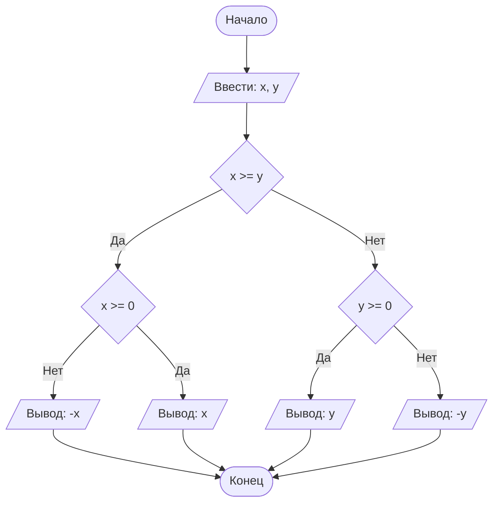

## Отчет по лабораторной работе № 2

#### № группы: `ПМ-2402`

#### Выполнила: `Белова Полина Сергеевна`

#### Вариант: `3`

### Cодержание:

- [Постановка задачи](#1-постановка-задачи)
- [Входные и выходные данные](#2-входные-и-выходные-данные)
- [Выбор структуры данных](#3-выбор-структуры-данных)
- [Алгоритм](#4-алгоритм)
- [Программа](#5-программа)
- [Анализ правильности решения](#6-анализ-правильности-решения)

### 1. Постановка задачи

> Программа получает на вход 2 целых числа N и M. Затем считывает ещё N x M целых чисел. Далее программа выполняет еще несколько действий, таких как: сортирование по столбцам по возрастанию методом пузырька, сортирование по строчкам по убыванию методом вставок, сортирование главной диагонали по возрастанию, вычисление количества нечётных элементов и их среднего арифмитического, вывод массива в зигзагообразном порядке, замена всех чётных чисел на их отрицательные значения и нечётных чисел на их квадраты.

#### Разобью для удобства свою работу на несколько подзадач:
> 
- №1. Создать массив, а также заполнить его числами. В этот шаг я еще для удобства и экономии времени добавлю вычисление количества нечётных чисел и найду их среднее арифмитическое.
- №2. Сортировка каждого столбца в порядке убывания методом пузырьков.
- №3. Сортировка каждой строчки в порядке возрастания методом вставок.
- №4. Вывод массива в зигзагообразном порядке с помощью 1 цикла (по условию).
- №5. Замена всех чётных чисел на их отрицательне значения и всех нечётных чисел на их квадраты.

### 2. Входные и выходные данные

#### Данные на вход

На вход программа должна получать 2 числа (N и M), которые задают массив, и далее X чисел, которыми мы этот массив заполняем. В условии сказано, что числа принадлежат множеству целых. Также следует отметить, что N и M не могут принимать неположительные значения, так как они задают массив. Количество элементов массива зависит от заданного размера: вычисляется по формуле N x M.

|             | Тип                       | min значение    | max значение   |
|-------------|---------------------------|-----------------|----------------|
| N (Число 1) | Целое положительное число | 1               | 2<sup>31</sup> |
| M (Число 2) | Целое положительное число | 1               | 2<sup>31</sup> |
| x           | Целое число               | -2<sup>31</sup> | 2<sup>31</sup> |


#### Данные на выход

На выход мы получаем всё те же элементы массива, которые могут принимать как отрицательное значение, как положительное, так и 0.

|         | Тип                                | min значением | max значение   |
|---------|------------------------------------|---------------|----------------|
| Число 1 | Целое число                        |-2<sup>31</sup>| 2<sup>31</sup> |

### 3. Выбор структуры данных

Программа получает 2 вещественных числа, не превышающих по модулю 10<sup>9</sup> < 2<sup>30</sup>. Поэтому для их хранения
можно выделить 2 переменных (`x` и `y`) типа `double`.

|             | название переменной | Тип (в Java) | 
|-------------|---------------------|--------------|
| N (Число 1) | `n`                 | `int`        |
| M (Число 2) | `m`                 | `int`        | 

Для вывода результата необязательно его хранить в отдельной переменной.

### 4. Алгоритм

#### Алгоритм выполнения программы:

1. **Ввод данных:**  
   Программа считывает два вещественных числа, обозначенные как `x` и `y`.

2. **Сравнение чисел:**  
   Программа сравнивает значения `x` и `y`. Если `x` больше или равно `y`, программа переходит к следующему шагу для
   работы с `x`. Если `y` больше, программа выполняет действия для работы с `y`.

3. **Проверка знака для выбранного числа:**
    - Если было выбрано число `x` (так как оно больше или равно `y`), проверяется, положительное оно или отрицательное.
      Если `x` положительное, оно выводится на экран. Если отрицательное, выводится его модуль (т.е. противоположное
      по знаку значение).
    - Если было выбрано число `y` (поскольку оно больше `x`), выполняется аналогичная проверка. Если `y` положительное,
      оно выводится на экран. Если отрицательное, выводится его модуль.

4. **Вывод результата:**  
   На экран выводится либо большее из чисел, либо его модуль, если это число отрицательное.

#### Блок-схема



### 5. Программа

```java
import java.io.PrintStream;
import java.util.Scanner;

public class Main {
    // Объявляем объект класса Scanner для ввода данных
    public static Scanner in = new Scanner(System.in);
    // Объявляем объект класса PrintStream для вывода данных
    public static PrintStream out = System.out;

    public static void main(String[] args) {
        // Считывание двух вещественных чисел x и y из консоли
        double x = in.nextDouble();
        double y = in.nextDouble();

        // Определение максимального числа
        if (x >= y) {
            // Если x положительное, выводим x, иначе выводим -x,
            // чтобы на выходе было его абсолютное значение
            if (x >= 0) {
                out.println(x);
            } else {
                out.println(-x);
            }
        } else {
            // Если x положительное, выводим y, иначе выводим -y,
            // чтобы на выходе было его абсолютное значение
            if (y >= 0) {
                out.println(y);
            } else {
                out.println(-y);
            }
        }
    }
}
```

### 6. Анализ правильности решения

Программа работает корректно на всем множестве решений с учетом ограничений.

1. Тест на `X > Y > 0`:

    - **Input**:
        ```
        5 1.3
        ```

    - **Output**:
        ```
        5
        ```

2. Тест на `X < Y < 0`:

    - **Input**:
        ```
        -4 -2.2
        ```

    - **Output**:
        ```
        2.2
        ```

3. Тест на `X < 0 < Y`:

    - **Input**:
        ```
        -4 5
        ```

    - **Output**:
        ```
        5
        ```

4. Тест на `X = 0` или `Y = 0`:

    - **Input**:
        ```
        0 -3
        ```

    - **Output**:
        ```
        3
        ```

5. Тест на ограничение задачи:

    - **Input**:
        ```
        -1000000000 1000000000
        ```

    - **Output**:
        ```
        1000000000
        ```
